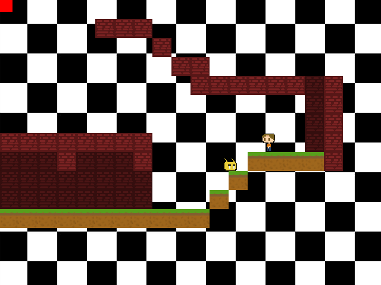

# VULNUS

<p align="center"></p>

## Introduction

**Vulnus** is a game that is being developed for fun, learning and teaching purposes. Its language is C++ with SFML.

## Features and TO DOs

- [x] Player
- [x] Level
- [x] Collision
- [x] Enemies
- [x] Cutscene
- [x] Multiple weapons
- [x] Menus
- [x] Scene changing
- [x] Timed actions handling
- [x] In game day of the week + time
- [x] World look modification on time changing
- [ ] Change of level
- [ ] Game over event
- [ ] Multiplayer
- [ ] Time conditioned events
- [ ] NPCs
- [ ] Database

## How to run

### Requisites
I don't have/use Windows OS. Then this guide will help you to test the game on Linux (Ubuntu distro);
To get the latest SFML library:
```
sudo apt-get install libsfml-dev
```

GCC (g++) compiler:
```
sudo apt-get install g++
```

## Compiling
To run this project, you will may want to compile it first. To do so, go to the root of the project folder via terminal and run the following:
```
make
```

And then, to execute it, you need to be at the **root of the project folder**. Then, run the following:
```
./bin/vulnus
```

## About the game

The game is a platform game.

### Controls

| Action | Keys
-------- | ---
| Movement | WASD or arrow keys
| Jump | W, Spacebar or Up arrow key
| Weapon | K
| Change Weapon | Q or E
| Teleport | Mouse click

### Time mechanics

The time is increased by 10 minutes every 5 seconds. There are no years, no months and no numeral days, just days of the week. The following schema shows all day sections:

| Section | Hour
------ | -------
| Morning | 6:00 AM
| Afternoon | 00:00 PM
| Evening | 6:00 PM
| Night | 10:00 PM

## Additional resources

### Fonts

#### Muli

The font, Muli, has its OFL license in fonts/Muli/OFL.txt.

### Sprites

#### Free Platformer Game Tileset: Scrolling background

The image, images/7536921_orig.png, is from **Zuhria Alfitra** a.k.a **pzUH**, at **Game Art 2D**. It was downloaded from the following URL:
- - -
http://www.gameart2d.com/free-platformer-game-tileset.html
- - -
"Not necessary to put my name or this site link. But I won't stop you if you do that. :p", pzUH. "You deserve credit for your awesome work! :D", me.

#### Free Winter Platformer Game Tileset: Scrolling background

The image, images/7579418\_orig.jpg (images/7579418\_altered.png is this image altered by myself because of SFML), is from **Zuhria Alfitra** a.k.a **pzUH**, at **Game Art 2D**. It was downloaded from the following URL:
- - -
http://www.gameart2d.com/winter-platformer-game-tileset.html
- - -

### Musics and sounds

#### Overworld

The music file, *sounds/overworld.ogg* is from **Royalty Free Music**, from **Incompetech**. As instructed in-site, this is the credits I give to it:
- - -
Overworld Kevin MacLeod (incompetech.com)
Licensed under Creative Commons: By Attribution 3.0 License
http://creativecommons.org/licenses/by/3.0/
- - -
You can listen to the music on YouTube: https://youtu.be/d5FVNxdZkfA

#### Happy 8bit Loop 01

The music file, *sounds/happy8bitloop.wav* is from **Tristan_Lohengrin**, at **freesound.org**. As instructed by the author, this is the credits I give to it:
- - -
"Happy 8bit Loop 01" by Tristan Lohengrin : http://tristanlohengrin.wixsite.com/studio
- - -

#### Concrete Footstep 4

The music file, *sounds/footstep.wav* (original) and *sounds/footstep.ogg* (edited by me to amplify the sound a little) is from **Yoyodaman234**, at **freesound.org**. Since the author doesn't show any template of crediting, it is listed at the domain in the URL bellow:
- - -
https://www.freesound.org/s/166506/
- - -

#### Mettalic Hit

The music file, *sounds/metallichit.wav* is from **dermotte**, at **freesound.org**. Since the author doesn't show any template of crediting, it is listed at the domain in the URL bellow:
- - -
https://www.freesound.org/s/263008/
- - -

## Author

[Murilo Bento](https://github.com/murilobnt) (murilo.araujo.md@gmail.com)